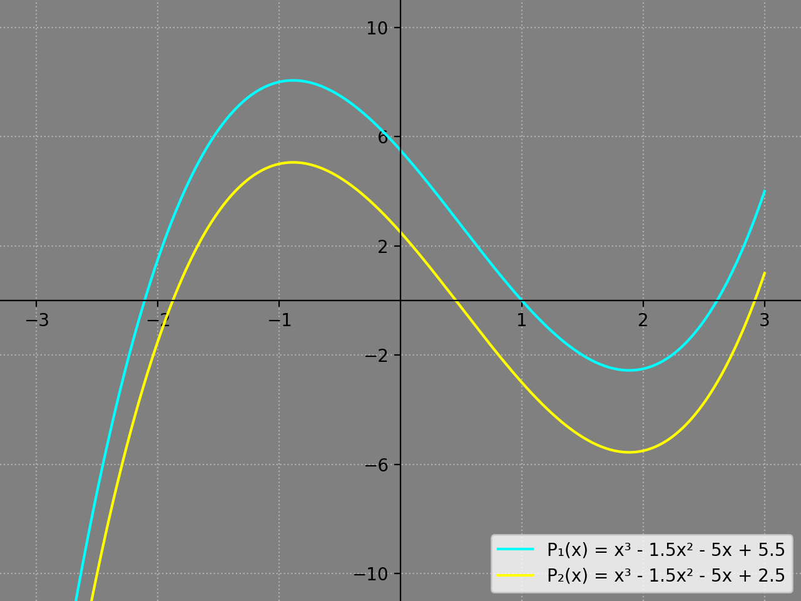

# Polynomial Tool v1.0.0

Contains a Polynomial class that encapsulates the usual arithmetic & calculus operations. I was curious how the `numpy.polynomial.polynomial` implemented its `Polynomial` class, and decided to create my own.

* **Fast:** computes the value of any Polynomial of degree **d** in *O(**d**) - via [Horner's Method](https://en.wikipedia.org/wiki/Horner%27s_method)*
* **Visual:** includes Plotting tool for custom graphing via `matplotlib.pyplot`
* **Pretty:** prints "mathematical" representation of Polynomial in a more readable format


## Implementation

To create a new Polynomial, pass in any number of scalars into `Poly()`, each representing the respective degree's coefficient in descending order. For example, let's output `x⁵ - 3.0x³ - x² + 0.5x - 3.14`:

```python
import Polynomial
p = Polynomial.Poly(1, 0, -3, -1, 0.5, -3.14)
print(p)
```


## Supported Operations

### *Calculus*
* **Derivative:** `differentiate()` returns differentiated `Poly` object
* **Tangent Line:** `tangent(x)` returns a line (i.e. Linear Polynomial) representing the tangent line of a Polynomial at a given point x
* **Integral:** `integrate(c)` returns integrated `Poly` object; c is the integrating constant (default = 0)

### *Algebra*
* **Addition:** `__add__()` returns summed `Poly` object
* **Subtraction:** `__sub__()` returns differenced `Poly` object
* **Scalar Multiplication:** `__mul__()` returns scaled `Poly` object

## Visualization

To graph Polynomials, pass in any number of `Poly()` objects into `polyplot()` - keyword arguments include:
* *xaxis_range* - controls absolute size of x-axis (default = 3)
* *yaxis_range* - controls absolute size of y-axis (default = 10)
* *titleString* - sets custom plot title above graph (default = No title)

```python
p1 = Poly(1, -1.5, -5, 5.5)
p2 = p1 - 3

polyplot(p1, p2)
```


## Running the tests

[*Coming Soon*] - Currently working on unit tests and will detail each test in this section.

## Future Tasks

- [X] Implement Unit Test for value method
- [X] Create Tangent method
- [ ] Create division method
- [ ] Create power method
- [ ] Create factoring method


